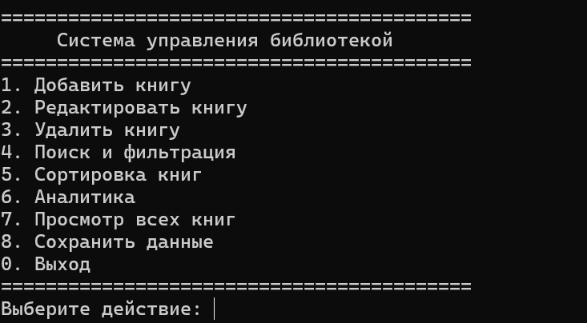
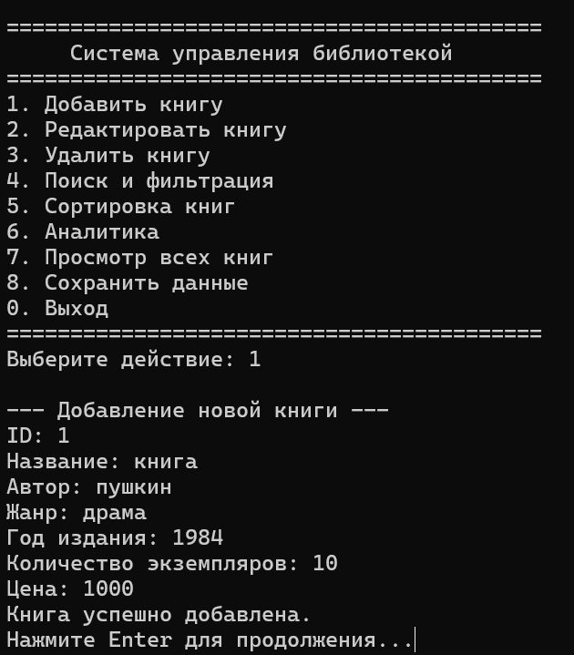
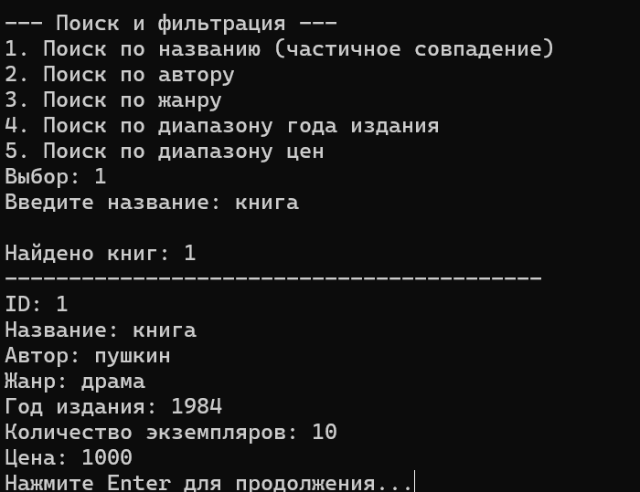
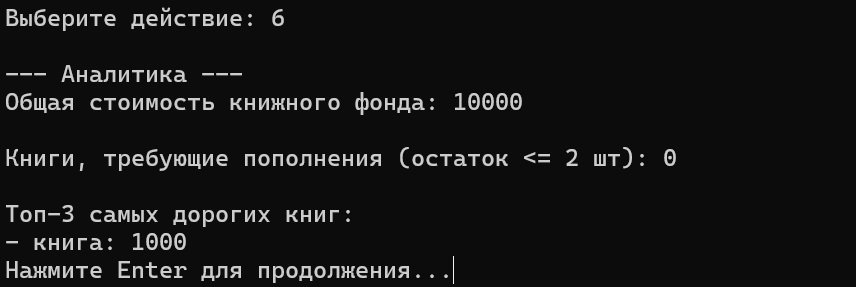

# LibraryApp

**ФИО: Агаев Тимур, Пинчук Богдан**<br>**Группа: 9ИС-345**

## Цель работы
Закрепить навыки объектно-ориентированного программирования, работы со стандартной библиотекой STL, файлового ввода-вывода, проектирования модульных приложений и обработки пользовательского ввода в среде C++.

## Постановка задачи
Разработать консольное приложение для автоматизации учёта книжного фонда библиотеки с добавлением, редактированием, удалением записей о книгах, поиском и фильтрацией каталога, сортировкой, расчётом аналитических показателей, а также сохранением и загрузкой данных в текстовом формате TXT.

## Технические требования
- Язык: C++17
- Хранение данных: std::vector
- Формат файла: TXT с разделителем (id,title,author,genre,year,copies,price)
- Обработка ошибок ввода: без аварийного завершения

## Структура проекта
```
LibraryApp/
├── src/
│   ├── main.cpp
│   ├── Book.h / Book.cpp
│   ├── Library.h / Library.cpp
│   ├── FileIO.h / FileIO.cpp
│   └── Menu.h / Menu.cpp
├── data/
│   └── catalog.txt
├── CMakeLists.txt
└── README.md
```

## Инструкция по установке

### Windows
1. Откройте Developer Command Prompt for VS или PowerShell с Visual Studio
2. Клонируйте репозиторий
3. Выполните:
```powershell
mkdir build
cd build
cmake .. -G "Visual Studio 17 2022"
cmake --build . --config Release
```
4. Запустите: `.\Release\LibraryApp.exe`

### Linux
```bash
mkdir build && cd build
cmake ..
make
./LibraryApp
```

## Функциональность
1. **CRUD операции**: добавление, редактирование, удаление книг
2. **Поиск и фильтрация**: по названию, автору, жанру, диапазону года издания, диапазону цен
3. **Сортировка**: по году издания, количеству экземпляров, названию, автору
4. **Аналитика**: общая стоимость книжного фонда, книги для пополнения (остаток <= 2), топ-3 самых дорогих
5. **Работа с файлами**: автозагрузка и ручное сохранение

## Скриншоты работы






## Комментарии к проекту
- Использован `std::filesystem` для создания директорий при сохранении
- Все пользовательские вводы валидируются без аварийного завершения программы